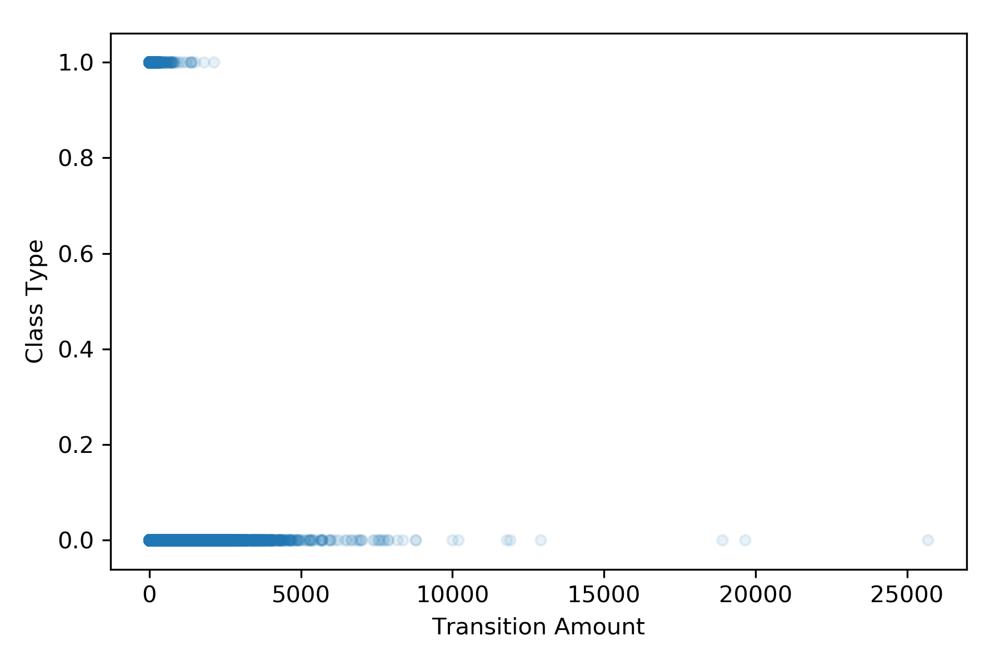
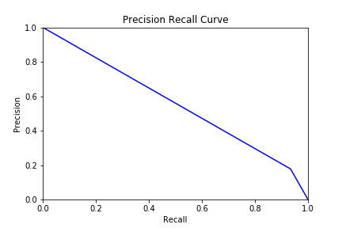

# AI - Credit Card Fraud Analysis
# Introduction: 
Credit card fraud is a wide-ranging term for theft and fraud committed using or involving a payment card, such as credit or debit card, as a fraudulent source of funds in a transaction. The purpose may be to obtain goods without paying, or to obtain unauthorized funds from an account. Credit card fraud is also an adjunct to identity theft. Therefore, it is important for credit card companies to recognize fraudulent transactions to ensure that customers are not charged for the items they did not purchase. However, Artificial Intelligence (AI) supported by Machine Learning (ML) has been able to assist the credit card companies to identify the type of ongoing transaction; either its legal (authentic) or fraudulent (non-authentic). With deep analysis on user’s previous transition history, a fraudulent transition can be predicted and avoided in future. Therefore, we consider to work on __*“Credit Card Fraud Detection System”*__, which can assist any credit card company to predict if fraudulent transition is performed. 
# Dataset Adaption Layout: 
We selected the dataset for *“Credit Card Fraud Detection System”* from a well-known site [Kaggle](https://www.kaggle.com), which hosts many credible datasets for implementing and testing various machine learning related Systems. Currently, the data set “Credit Card Fraud Detection System” contains credit card transactions over a two day collection period in September 2013 by European cardholders. It contains transactions that occurred within two days having a list of 284,807 transactions of which 492 (0.172%) are fraudulent. To maintain confidentiality of sensitive information, principal components analysis (PCA) was applied by the original authors on the dataset containing numerical variables. Additionally the dataset contains Time and Amount, which were not transformed by PCA. Additionally the dataset contains Time and Amount, which were not transformed by PCA. The Time variable contains the seconds elapsed between each transaction and the first transaction in the dataset. The Amount variable is the transaction amount, this feature can be used for example-dependent cost-sensitive learning. The Class variable is the response variable and indicates whether the transaction was fraudulent.
# Model:
*	The data is split into 5 train/test sets
*	For each split, a multi-layer perceptron (MLP) neural network is used having following characteristics:
* 28 input nodes
* 22 nodes for densely connected hidden layer having
* S-shaped rectified linear activation and 20% dropout
* 1 output node with a sigmoid activation.

The models are fit using batches of 1200 observations for up to 100 epochs, although validation loss (binary cross entropy) is monitored to permit early stopping.

The models are implemented in Python using Keras and TensorFlow as the backend

# Data Set Analysis
## Authentic vs Fradulent Cases 
The first graph shown is between Transition Amount and Class Type. Class Type indicates whether the transition amount is authentic i.e.0 or fradulent i.e.1. It is clear that class type 1 transition amount ranging from 0 to 5000 have most fradulet cases.

# Performance
The final model achieves an overall f1 score of 1.00, with 95% sensitivity (recall) and 19% precision for the positive class. That is, the model correctly identifies 95% of the fraud cases (true positives) but only 19% of the transactions predicted as fraudulent were actually fraudulent. The model catches 95% of the fraudulent cases — it could identify more cases of fraud but would then also have lower precision.
# classification Report

|   	|  precision 	|  recall 	|  f1-score 	| support  	|
|0.00	|1.00	|0.99	|---	|---	|
|1.0	|   	|   0.93	|   	|   	|
|avg/total |1.00   	|   0.93	|   	|   	|

## ROC

## Precision Recall Curve

[Contribution guidelines for this project](figures/CONTRIBUTING.md)
